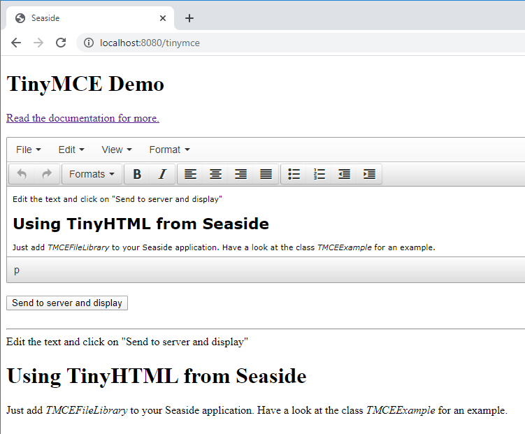

# Seaside-TinyMCE
Seaside wrapper for Tiny MCE Editor

# TinyMCE for Seaside

## Project info

The "TinyMCE for Seaside" project provides the [TinyMCE][1] editor libraries for use in Seaside applications.

### Project location
The project is located on GitHub at [https://github.com/astares/Seaside-TinyMCE](https://github.com/astares/Seaside-TinyMCE)

### License
The Smalltalk code is under MIT License. Note that TinyMCE has an LGPL license.

## Installation
First install Seaside into your Pharo image:

```Smalltalk
Metacello new
  baseline:'Seaside3';
  repository: 'github://SeasideSt/Seaside:develop/repository';
  load.
```

Now you can install the packages necessary for TinyMCE by evaluating:

```Smalltalk
   Metacello new
      baseline:'TinyMCE';
      repository: 'github://astares/Seaside-TinyMCE:master/src';
      load
```

## Run locally

After starting the Seaside server you can check out the example at

    http://localhost:8080/tinymce
    
    


## How to use
### Add the file library

As usual you should create a subclass of WAComponent for an own Seaside web application component. To use the library just register it with your Seaside application.

    register
    |app|
	  app := WAAdmin register: self asApplicationAt: 'tinymce'.
	  app addLibrary: TMCEFileLibrary 

### Render the editor component

To render the editor component you just need a textArea tag in your generated HTML code and modify it to be a TinyMCE Editor using a simple JavaScript. Here is an example Seaside rendering method:

    renderContentOn: html

	    html heading: 'TinyMCE Demo'.
    	html form: [ 
	    	html textArea 
	       		callback: [ :value | text := value];
	    		with: text.
	    	html break.	
	    	html submitButton: 'Send to server and display'.	
    	].
    	html break; horizontalRule.	
	    html html: text.

    	"Add the script to run TinyMCE"	
    	html script: ' tinymce.init({selector:''textarea''});'

Check out the [TinyMCE](http://www.tinymce.com) documentation for more.


    
